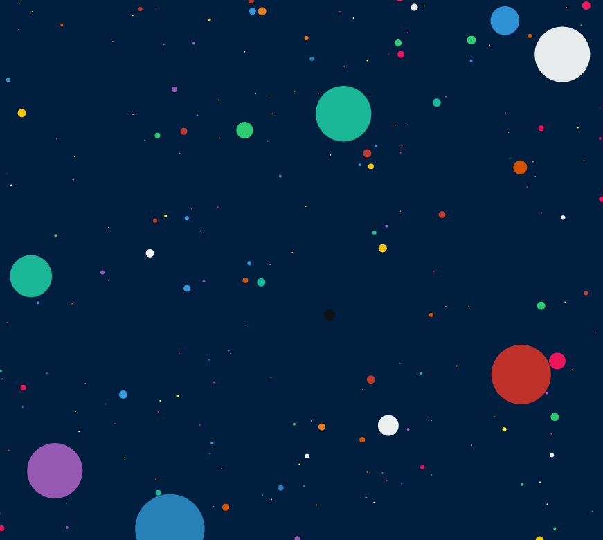

#CellSurvival

[CellSurvival live][github]

[github]: https://gearfix.herokuapp.com/#/

CellSurvival a game loosely based on Agar.io, where the user controls a cell and
attempts to grow and absorb all the other cells.

## Features & Implementation

### Area Absorption on Collision
When 2 cells collide, the radius of the smaller one is reduced by 1 (or the
entire cell is destroyed if it's radius is less than 1), and the area of the
larger cell increases by the same amount that the smaller cell lost. Under this
system, the area of the cells is conserved.  Due to the fact that the cells are
moving in different directions, partial loss of area can occur if the smaller
cell's radius is reduced to a point that the cells no longer touch.

### Color Absorption on Collision
Not only does the area of the smaller cell become absorbed, but the color of the
larger cell adjusts by applying the weight of the area increase to the color of
the smaller cell, and doing a weighted average with the larger cell's area and
color.
